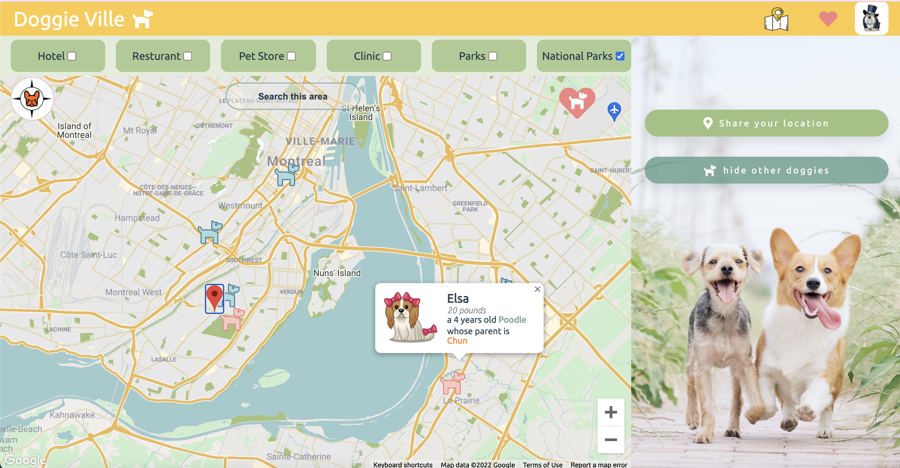

# Doggie-Ville

It is a Dog-Friendly Business Finder and Social Network App!

Developed an interactive web app with React.js that allows the user to search pet-friendly businesses based on location and business categories.

Implemented an embedded Google Map on which search results will displayed as markers. Users can access business details when clicking the markers and save businesses as their favorites.

Users can create/modify profiles, share current location with other users and find playmates based on their location.

Technology used: React.js, Styled Components, GoogleMap API, CSS, Context, Node.js, MongoDB, Express, RESTful endpoints.

---

## The App

### Screenshots

### HomePage

### SignUp form

### Sign in

### Map page with category selection after sign in

### Business detail page and national park detail page

### Show favorites as markers on the map

### Show favorites list

### Show other doggies

### Edit your profile and error

